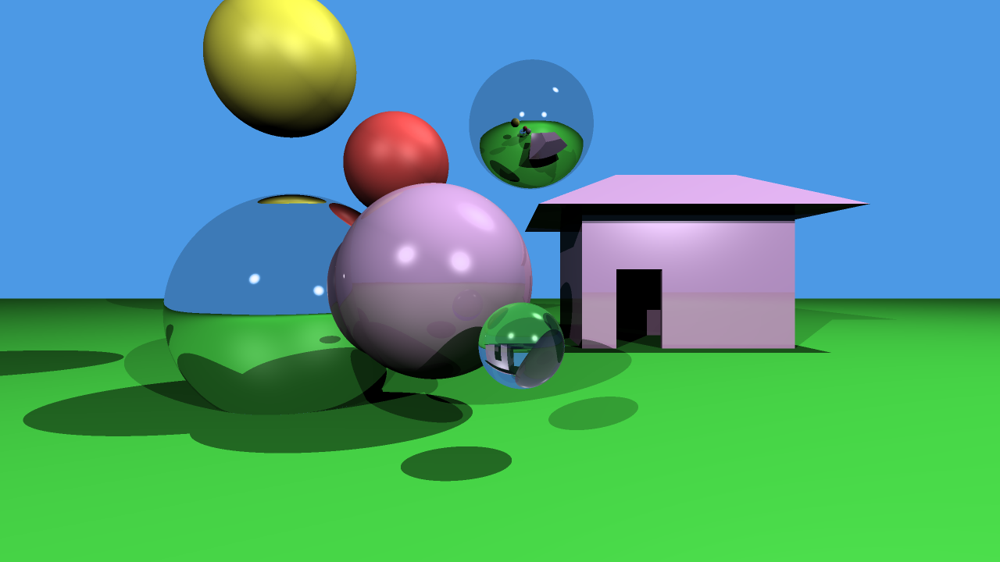

# Rustracer
A custom software raytraced 3D renderer that uses no external libraries or frameworks for it's rendering model. I'm writing it to better understand graphics programming, low-level systems, and Rust.

## Features:
-Diffuse lighting.\
-Specular illumination.\
-PPM output.\
-Fast low-level performance.

## Compilation:
Install [Rust]((https://www.rust-lang.org/tools/install)) and then run "rustc main.rs -o rustracer" for Linux or "rustc main.rs -o rustracer.exe" on Windows.

## Project Structure:
main.rs <- This is what runs the raytracing calculations and rendering.\
definitions.rs <- This defines the data and geometry that is used for rendering (Vector3, Lights, Materials, etc).\
out.ppm <- This is the output of the renderer, easily viewable in [GIMP](https://www.gimp.org/downloads/).

## Sample Output:

