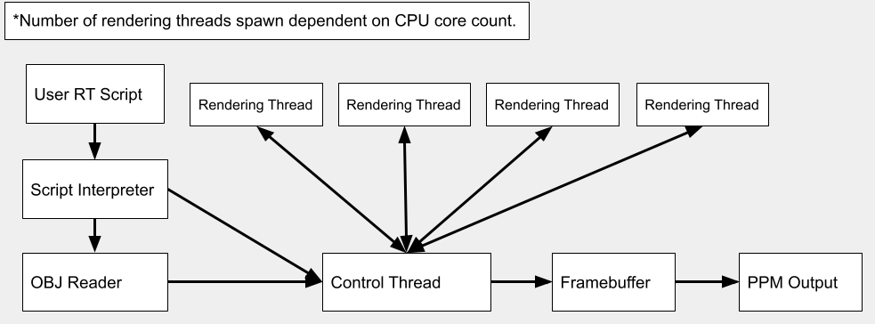

# Rustracer
A custom software raytraced 3D renderer that uses no external libraries or frameworks for its rendering model. I'm writing it to better understand graphics programming, low-level systems, and Rust.\

## Compilation:
Install [Rust](https://www.rust-lang.org/tools/install) and then run "rustc main.rs -o rustracer" for Linux or "rustc main.rs -o rustracer.exe" on Windows.

## Sample Output:
\
\

## Features:
-Raytraced reflections, refraction, and shadows.\
-Multithreading support.\
-Custom script interpreter.\
-Diffuse lighting.\
-Specular illumination.\
-Anti-Aliasing\
-PPM output.\
-OBJ input.\
-Fast low-level performance.

## Project Structure:
src/main.rs <- This is what runs the raytracing calculations and rendering.\
src/model.rs <- This parses and sets up our 3D models that we've fed in as OBJ files.\
src/definitions.rs <- This defines the data and geometry that is used for rendering (Vector3, Lights, Materials, etc).\
docs/ <- This is where the documentation is stored.\
res/ <- This is where the models are stored.\
compile.sh <- This is a Linux shell script you may run to compile the project.\
out.ppm <- Will be the output of the renderer, easily viewable in [GIMP](https://www.gimp.org/downloads/).

